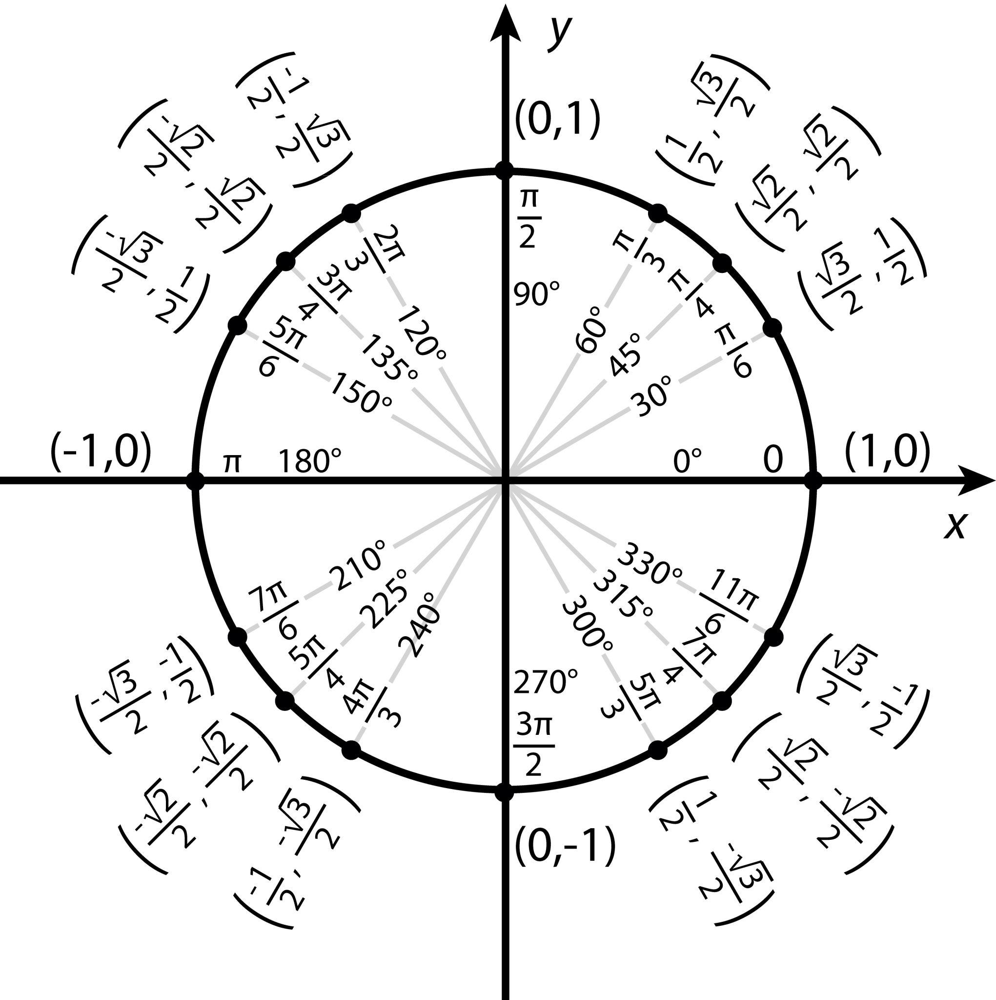
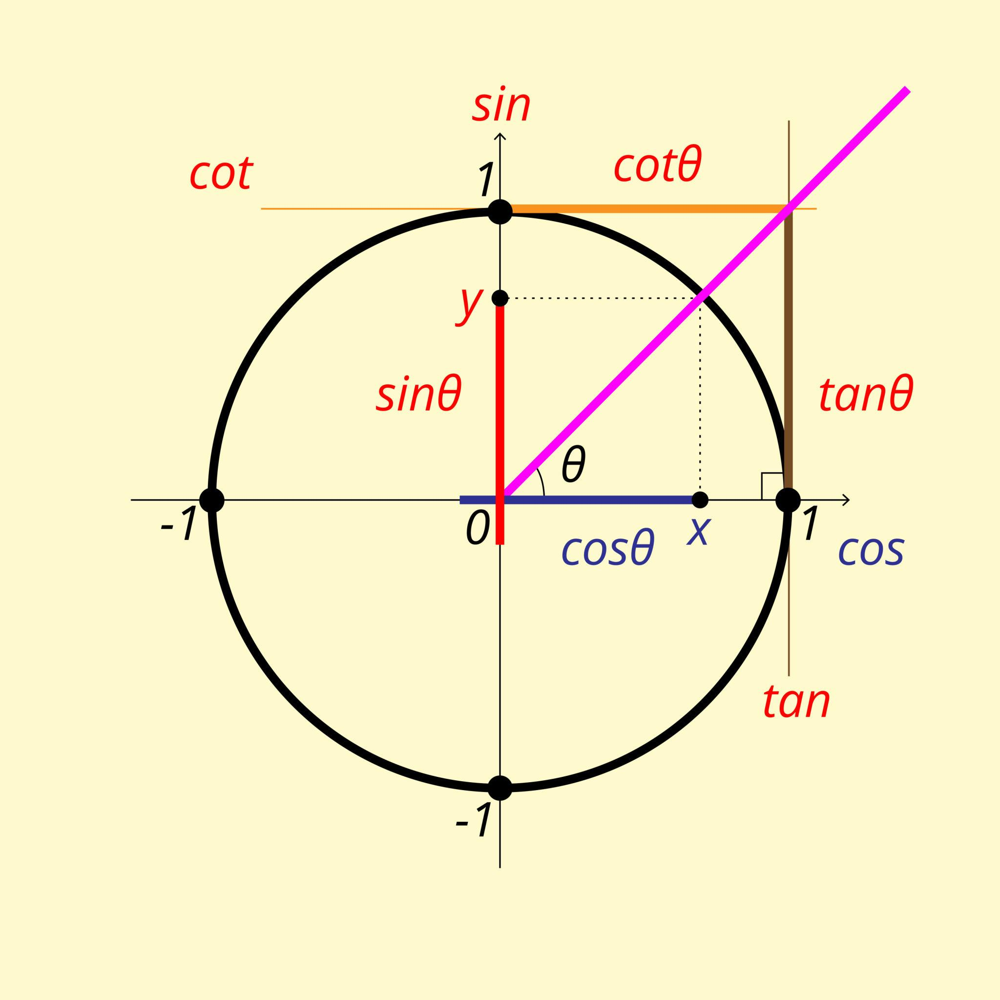

# Calculus I Trigonometry Cheat Sheet

---

# Unit Circle (Key Angles)

| Angle | $\sin\theta$ | $\cos\theta$ | $\tan\theta$ |
|------|--------------|--------------|--------------|
| $0$ | $0$ | $1$ | $0$ |
| $\frac{\pi}{6}$ | $\frac{1}{2}$ | $\frac{\sqrt{3}}{2}$ | $\frac{1}{\sqrt{3}}$ |
| $\frac{\pi}{4}$ | $\frac{\sqrt{2}}{2}$ | $\frac{\sqrt{2}}{2}$ | $1$ |
| $\frac{\pi}{3}$ | $\frac{\sqrt{3}}{2}$ | $\frac{1}{2}$ | $\sqrt{3}$ |
| $\frac{\pi}{2}$ | $1$ | $0$ | undefined |
| $\pi$ | $0$ | $-1$ | $0$ |

 

---

# Derivatives of Trigonometric Functions

$$
\frac{d}{dx}(\sin x) = \cos x
$$

$$
\frac{d}{dx}(\cos x) = -\sin x
$$

$$
\frac{d}{dx}(\tan x) = \sec^2 x
$$

$$
\frac{d}{dx}(\cot x) = -\csc^2 x
$$

$$
\frac{d}{dx}(\sec x) = \sec x \tan x
$$

$$
\frac{d}{dx}(\csc x) = -\csc x \cot x
$$

---

### Pythagorean Identities (MOST IMPORTANT)

sin²x + cos²x = 1

1 + tan²x = sec²x   ← (used constantly)

1 + cot²x = csc²x

### Rearranged Forms (you’ll use these a lot)

tan²x = sec²x − 1

sec²x − tan²x = 1

csc²x − cot²x = 1

# Inverse Trigonometric Functions
| Function | Domain | Range |
|----------|--------|-------|
| $\arcsin x$ | $[-1,1]$ | $[-\frac{\pi}{2},\frac{\pi}{2}]$ |
| $\arccos x$ | $[-1,1]$ | $[0,\pi]$ |
| $\arctan x$ | $(-\infty,\infty)$ | $(-\frac{\pi}{2},\frac{\pi}{2})$ |
| $\operatorname{arccot} x$ | $(-\infty,\infty)$ | $(0,\pi)$ |
| $\operatorname{arcsec} x$ | $\lvert x \rvert \ge 1$ | $[0,\pi],\ y \ne \frac{\pi}{2}$ |
| $\operatorname{arccsc} x$ | $\lvert x \rvert \ge 1$ | $[-\frac{\pi}{2},\frac{\pi}{2}],\ y \ne 0$ |

# Trigonometric Functions from the Unit Circle

On the unit circle, a point corresponding to an angle $\theta$ has coordinates

$$
(\cos\theta,\ \sin\theta)
$$

This means:

- the **x-coordinate** equals $\cos\theta$
- the **y-coordinate** equals $\sin\theta$

From this point we can define all six trigonometric functions.

---

# The Six Trigonometric Functions

| Function | Definition | From the point $(x,y)$ |
|--------|--------|--------|
| $\sin\theta$ | opposite / hypotenuse | $y$ |
| $\cos\theta$ | adjacent / hypotenuse | $x$ |
| $\tan\theta$ | opposite / adjacent | $\frac{y}{x}$ |
| $\cot\theta$ | adjacent / opposite | $\frac{x}{y}$ |
| $\sec\theta$ | $1/\cos\theta$ | $\frac{1}{x}$ |
| $\csc\theta$ | $1/\sin\theta$ | $\frac{1}{y}$ |

---

# Visual Interpretation

If a point on the unit circle is

$$
(x,y) = (\cos\theta,\sin\theta)
$$

then

$$
\tan\theta = \frac{\sin\theta}{\cos\theta} = \frac{y}{x}
$$

$$
\sec\theta = \frac{1}{\cos\theta} = \frac{1}{x}
$$

$$
\csc\theta = \frac{1}{\sin\theta} = \frac{1}{y}
$$

$$
\cot\theta = \frac{\cos\theta}{\sin\theta} = \frac{x}{y}
$$

---

# Example

For

$$
\theta = \frac{\pi}{6}
$$

the unit circle point is

$$
\left(\frac{\sqrt3}{2},\frac12\right)
$$

So

$$
\sin\left(\frac{\pi}{6}\right) = \frac12
$$

$$
\cos\left(\frac{\pi}{6}\right) = \frac{\sqrt3}{2}
$$

$$
\tan\left(\frac{\pi}{6}\right)
=
\frac{\frac12}{\frac{\sqrt3}{2}}
=
\frac{1}{\sqrt3}
$$

$$
\sec\left(\frac{\pi}{6}\right)
=
\frac{1}{\frac{\sqrt3}{2}}
=
\frac{2}{\sqrt3}
$$

$$
\csc\left(\frac{\pi}{6}\right)
=
\frac{1}{\frac12}
=
2
$$

$$
\cot\left(\frac{\pi}{6}\right)
=
\frac{\frac{\sqrt3}{2}}{\frac12}
=
\sqrt3
$$

---

# Key Idea

Everything comes from the unit circle point

$$
(\cos\theta,\sin\theta)
$$

Once you know the coordinates, all six trig functions follow from simple ratios.

# Meaning of Inverse Trigonometric Functions

Inverse trig functions ask for an **angle**.

Example:

$$
\sin^{-1}(x)
$$

means:

> What angle has sine equal to $x$?

Example:

$$
\sin^{-1}\left(\frac{1}{2}\right)
$$

We look for the unit circle angle where

$$
\sin(\theta) = \frac{1}{2}
$$

From the unit circle:

$$
\theta = \frac{\pi}{6}
$$

So:

$$
\sin^{-1}\left(\frac{1}{2}\right) = \frac{\pi}{6}
$$

---

# Mental Shortcut for Inverse Trig Problems

When solving expressions like

$$
\sin^{-1}(0.5)
$$

use this 3-step process.

### Step 1 — Find the unit circle angle

Solve

$$
\sin(\theta) = 0.5
$$

From the unit circle:

$$
\theta = \frac{\pi}{6}
$$

---

### Step 2 — Check the inverse trig range

For arcsin:

$$
-\frac{\pi}{2} \le y \le \frac{\pi}{2}
$$

Since

$$
\frac{\pi}{6}
$$

is inside this interval, it is valid.

---

### Step 3 — Write the answer

$$
\sin^{-1}(0.5) = \frac{\pi}{6}
$$

---

# Example Problems

### Example 1

$$
\cos^{-1}(-1)
$$

Ask:

$$
\cos(\theta) = -1
$$

From the unit circle:

$$
\theta = \pi
$$

Check the allowed range for arccos:

$$
0 \le y \le \pi
$$

So the answer is

$$
\cos^{-1}(-1) = \pi
$$

---

### Example 2

$$
\sin^{-1}(0.5)
$$

Solve

$$
\sin(\theta) = \frac{1}{2}
$$

Unit circle angle:

$$
\theta = \frac{\pi}{6}
$$

Check arcsin range:

$$
-\frac{\pi}{2} \le y \le \frac{\pi}{2}
$$

Final answer:

$$
\sin^{-1}(0.5) = \frac{\pi}{6}
$$

---

# Key Reminder

When you see inverse trig:

$$
\sin^{-1}(x),\ \cos^{-1}(x),\ \tan^{-1}(x)
$$

always think:

1. Find the **unit circle angle**
2. Check the **principal range**
3. That angle is the answer

# Inverse Trigonometric Derivatives Cheat Sheet

## arcsin
$y = \sin^{-1}(x)$  
$\displaystyle \frac{d}{dx}[\sin^{-1}(x)] = \frac{1}{\sqrt{1 - x^2}}$

## arccos
$y = \cos^{-1}(x)$  
$\displaystyle \frac{d}{dx}[\cos^{-1}(x)] = -\frac{1}{\sqrt{1 - x^2}}$

## arctan
$y = \tan^{-1}(x)$  
$\displaystyle \frac{d}{dx}[\tan^{-1}(x)] = \frac{1}{1 + x^2}$

---

## Chain Rule Versions

### arcsin
$\displaystyle \frac{d}{dx}[\sin^{-1}(u)] = \frac{u'}{\sqrt{1 - u^2}}$

### arccos
$\displaystyle \frac{d}{dx}[\cos^{-1}(u)] = -\frac{u'}{\sqrt{1 - u^2}}$

### arctan
$\displaystyle \frac{d}{dx}[\tan^{-1}(u)] = \frac{u'}{1 + u^2}$

---

## Domain Notes

### arcsin and arccos
$-1 \le x \le 1$

### arctan
$(-\infty, \infty)$

---

## Recognition Tips

- $\sin^{-1}(x)$ = arcsin (NOT $1/\sin(x)$)
- Square root → arcsin / arccos
- $1 + x^2$ → arctan
- arccos is the SAME as arcsin but NEGATIVE

---

## Example

$\displaystyle \frac{d}{dx}[\sin^{-1}(5x)] = \frac{5}{\sqrt{1 - 25x^2}}$